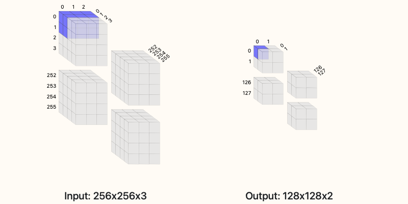

# Convolution calculator

This is a calculator to help you construct convolution layers in neural networks.

See the finished product at [https://oliver-ernst.com/convolution-calculator](https://oliver-ernst.com/convolution-calculator).

Or, embed this calculator on your own site by following the instructions below.



## Embed this on your site

This is a JS project (relies on jQuery, Bootstrap 4, and Material icons). You can embedd it on your own page (it is under MIT license).

1. Add the required jQuery, Bootstrap 4, and Material icons to your page.
    ```
    <!-- Bootstrap CSS -->
    <link rel="stylesheet" href="https://stackpath.bootstrapcdn.com/bootstrap/4.3.1/css/bootstrap.min.css" integrity="sha384-ggOyR0iXCbMQv3Xipma34MD+dH/1fQ784/j6cY/iJTQUOhcWr7x9JvoRxT2MZw1T" crossorigin="anonymous">

    <!-- Google Material Icons -->
    <link href="https://fonts.googleapis.com/icon?family=Material+Icons" rel="stylesheet">

    <!-- JQuery -->
    <script src="https://ajax.googleapis.com/ajax/libs/jquery/3.5.1/jquery.min.js"></script>
    ```

2. Grab the main JS file `convCalc.js` from this repo and add it to your page assets. Alternatively, use the awesome `jsDelivr` CDN:
    ```
    <script src="https://cdn.jsdelivr.net/gh/smrfeld/convolution-calculator/convCalc.js"></script>
    ```
    Or you can even get the minified version:
    ```
    <script src="https://cdn.jsdelivr.net/gh/smrfeld/convolution-calculator/convCalc.min.js"></script>
    ```

3. Insert the div where the content will be loaded.
    ```
    <div id='ccContainer'></div>
    ```
    You can also specify the width:
    ```
    <div id='ccContainer' style="width:800px;"></div>
    ```

4. Trigger the JS to inject the drawing into the div when the page loads.
    ```
    <script>
        $(document).ready(function() {
            // Set up
            ccSetUp();
        });
    </script>
    ```
    This will populate the `ccContainer` div.

## CDN

CDN is hosted over GitHub assets using jsDelivr as described [here](https://medium.com/javarevisited/how-to-host-your-repository-js-css-on-open-source-cdn-jsdelivr-4de252d6fbad).

## About convolutions

This calculator supports inputs which are 2-dimensional such as images or 1-dimensional such as timeseries (set one of the width/height dimensions to 1).

You can visualize how the different choices tile your input data and what the output sizes will be.

The basic formula for the number of outputs from the convolution operation is:
```
(W−F+2P)/S+1
```
where `W` is the size of the input (width or height), `F` is filter extent, `P` is the padding, and `S` is the stride.
Note that for this calculator, only square filters are supported (the filter extent `F` controls both the width and height of the convolution) 
- in reality, non-square convolutions are also possible.